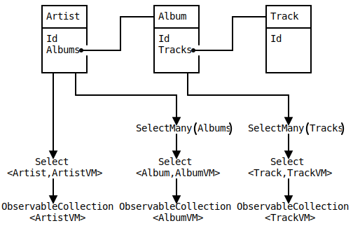
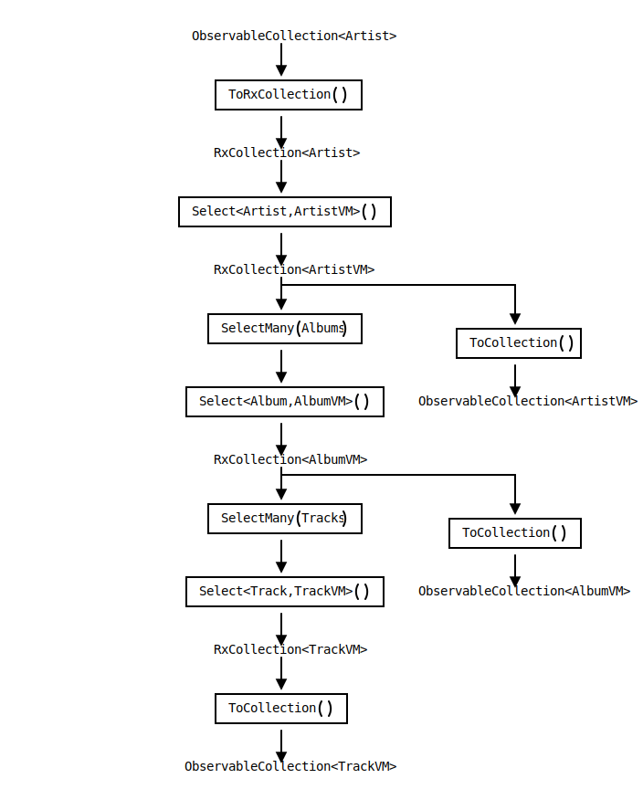

    

Undoubtedly, ReactiveX provides a more abstract programming paradigm which enables us to manage state and data flow in applications in an aggregated, traceable, and responsive manner. However, it's worth noting that ReactiveX does not provide data persistence, which means that we need to manually read DAO and display ViewModel, such as implementing the repository mode and using ObservableCollection, and in this scenario ReactiveX only plays the role of the BLL, did not show its full power.
<!--more-->

## Data Structure Design ##
In terms of database, I use the artist entity as the entry point, the album entity as the first-level foreign key, and the track entity as the second-level foreign key. In terms of ORM, the related data uses the `IList` property according to the structure of the database. In terms of ViewModel, the structural information in the database is no longer saved, and the `ObservableCollection` without nesting is used directly.

However, this design brings the problem of data consistency, that is, when the DAL data changes, it cannot be synchronized to the ViewModel natively. Of course, we have various ways to achieve data synchronization, such as listening to the CollectionChanged event exposed by the DAL in BLL, but this approach will add a lot of spaghetti code, making the BLL code not pure enough. Some people may say that by adding another layer of abstraction between BLL and DAL to shield out DAL events.

This is a wrong way, in fact, with ReactiveX you can complete this set of processes without adding strange spaghetti code.

## Unidirectional Data Flow with ReactiveX ##
In the past, the concept of unidirectional data flow has been widely used in the field of desktop application development, but no such term has yet been proposed. In recent years, as the front-end tool chain has matured, many new concepts have been proposed in the front-end community, and unidirectional data flow is one of them. The purpose of the unidirectional data flow is that the data changes are propagated naturally from top to bottom, and ReactiveX can perfectly realize this concept.

As shown in the figure, `ObservableCollection<Artist>` is defined as the upstream of the ReactiveX stream. The origin of all data comes from this, and the downstream not only has the backbone, but also the tributaries. Their content depend on `ObservableCollection<Artist>` and all its changes will be automatically assisted by ReactiveX to propagate down.

Just like the concept in the front-end technology stack, the objects located downstream in the figure cannot directly add or delete items in the collection, but can only notify the upstream to operate the collection by firing events. In this way, BLL does not need to consider every change in DAL. When reactive DAO is obtained from DAL, ReactiveX will accomplish everything.

Because ReactiveX itself does not have the feature of data persistence, the methods and classes in the figure are not provided by ReactiveX. I just call them like this for ease of explanation. Among them, `RxCollection` is a class similar to `ReplaySubject`. In order to get pure `Observable`, `ToRxCollection()` will convert ObservableCollection to it. ToRxCollection() is a method defined on RxCollection, which internally captures each reactive change and persists it on the ObservableCollection object. The reason to define additional RxCollection objects is to avoid polluting global `Observable` objects when implementing stream api.

## DynamicData: Library Implements Reactive Collections ##
Now that we have thoughts, concepts, and plans, we are only lacking an assistant who can achieve these, and DynamicData exactly fills this gap.

DynamicData implements RxCollection in two ways, namely `SourceList` and `SourceCache`. SourceCache is an SourceList with unique key, which is helpful when doing a lot of random access in the collection, but I won’t introduce it here. 

For `SourceList`, DynamicData not only defines many common collection apis, such as Select, SelectMany, Join, GroupBy and so on but also defines many ReactiveX operators, such as BatchIf, DynamicFilter and so on. This is convenient for us to deal with various situations in the data flow and combine our business logic.

In order to declare the source of an ReactiveX stream, the method provided by DynamicData is to instantiate a `SourceList` and invoke its `Connect()` method. This method will return an `Observable` to prevent all external operations on the source. Once this object is obtained, we can use DynamicData like the usual ReactiveX object and persist it to an ObservableCollection object at the end of the ReactiveX stream.
