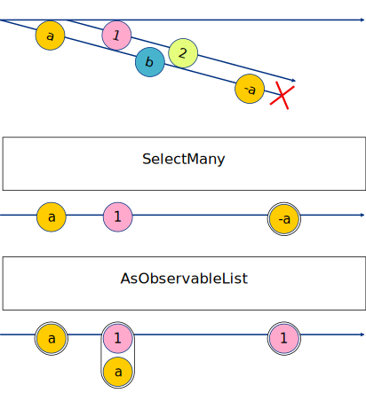
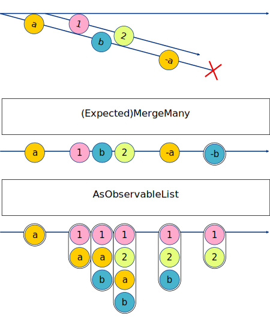

<div class="banner-img">
    
</div>

The previous article mentioned that DynamicData can be used to construct unidirectional data flow, but in actual, you may encounter unexpected result when using `MergeMany` operator, which is caused by a flaw in the implementation by DynamicData. Elements that have been removed in the upstream of reactive stream may still appear in the downstream, and this article will discuss this issue in detail.
<!--more-->

## SelectMany and MergeMany in DynamicData ##
For a data structure likes `IObservable<SourceList<T>>`, although it was written in the last article that the method SelectMany is used for flattening, the result obtained in this way is not what we want. This is because the operator `SelectMany` implemented by DynamicData is not completely react, and the operator `MergeMany` is what we really need.

So, what is the different between `SelectMany` and `MergeMany`? The remarks and function signatures of the two operators do not provide enough information, and here I will use marble diagrams and unit test to show you. For ease of explanation, elements of "-a" stands for `a.Remove('a')`, the error ending without arrow stands for `parent.Remove(a)`, and the result timeline stands for persisted data.

<!--
marble select_many
{
 source a:
 {
  +-(a)--(b)--(a)#
  ..+-(1)-(2)->
 }
 operator SelectMany:  +-a-1----{a}>
 operator AsObservableList:  +-{a}-{1,a}----{1}>
}
-->


```csharp
[Fact]
public static void SelectMany()
{
    var a = new SourceList<char>();
    a.Add('a');
    var b = new SourceList<char>();
    b.Add('1');

    var parent = new SourceList<SourceList<char>>();
    parent.Add(a);
    var d = parent.Connect()
        .SelectMany(x => x.Items)
        .Sort(SortExpressionComparer<char>.Ascending(x => x))
        .AsObservableList();

    d.Items.Should().BeEquivalentTo(new[] { 'a' });
    parent.Add(b);
    d.Items.Should().BeEquivalentTo(new[] { '1', 'a' });
    a.Add('b');
    d.Items.Should().BeEquivalentTo(new[] { '1', 'a' });
    b.Add('2');
    d.Items.Should().BeEquivalentTo(new[] { '1', 'a' });
    a.Remove('a');
    d.Items.Should().BeEquivalentTo(new[] { '1', 'a' });
    parent.Remove(a);
    d.Items.Should().BeEquivalentTo(new[] { '1' });
}
```

<!--
marble expected_merge_many
{
 source a:
 {
  +-(a)--(b)--(a)-#
  ..+-(1)-(2)->
 }
 operator (Expected)MergeMany: +-a-1b2-a-{b}>
 operator AsObservableList:  +-{a}-{1,a}{1,a,b}{1,2,a,b}-{1,2,b}-{1,2}>
}
-->


```csharp
[Fact]
public static void ExpectedMergeMany()
{
    var a = new SourceList<char>();
    a.Add('a');
    var b = new SourceList<char>();
    b.Add('1');

    var parent = new SourceList<SourceList<char>>();
    parent.Add(a);
    var d = parent.Connect()
        .MergeMany(x => x.Connect())
        .Sort(SortExpressionComparer<char>.Ascending(x => x))
        .AsObservableList();

    d.Items.Should().BeEquivalentTo(new[] { 'a' });
    parent.Add(b);
    d.Items.Should().BeEquivalentTo(new[] { '1','a' });
    a.Add('b');
    d.Items.Should().BeEquivalentTo(new[] { '1','a','b' });
    b.Add('2');
    d.Items.Should().BeEquivalentTo(new[] { '1', '2', 'a', 'b' });
    a.Remove('a');
    d.Items.Should().BeEquivalentTo(new[] { '1', '2', 'b' });
    parent.Remove(a);
    // ❌ Asset failed, the result is { '1', '2', 'b' }
    // Ignore this issue for now, I will explain below
    d.Items.Should().BeEquivalentTo(new[] { '1', '2' });
}
```

As shown in the diagram, compared with MergeMany, after adding the 2nd order Observable, SelectMany can only emit elements once, and all changes of added Observables will not be forwarded to the result of it. In other words, a one-time binding is established between two order Observables without observable changes.Therefore, for our fully reactive demand, operator MergeMany should be choosen.

## Encountered Unexpected Value ##
When I use nested SourceList, the situation becomes more complicated. Not only does the result Observable not delete the elements of the 2nd order Observable when removing it, but also when the elements in the 2nd order Observable are directly removed, these changes will not be forward to the result.

Since this situation is too complicated to be represented by a diagram, I have written a unit test to verify it:

```csharp
class TestClass : IDisposable
{
    public ISourceList<int> List { get; set; } = new SourceList<int>();
    public int Index { get; set; }
    public TestClass(int index) { Index = index; }
    public void Dispose() { Console.WriteLine($"TestClass[{Index}] disposed."); }
}
```

```csharp
[Fact]
public static void NestedSourceListWithMergeManyEx()
{
    var b1 = new TestClass(1);
    b1.List.AddRange(new List<int> { 1, 2 });
    var b2 = new TestClass(2);
    b2.List.AddRange(new List<int> { 10, 20 });
    var b3 = new TestClass(3);
    b3.List.AddRange(new List<int> { 100, 200 });

    var parent = new SourceList<TestClass>();
    var d = parent.Connect()
        .MergeMany(x => x.List.Connect())
        .DisposeMany()
        .AsObservableList();

    parent.Add(b1);
    d.Items.Should().BeEquivalentTo(new[] { 1, 2 });
    b1.List.Add(3);
    d.Items.Should().BeEquivalentTo(new[] { 1, 2, 3 });
    b1.List.Remove(3);
    d.Items.Should().BeEquivalentTo(new[] { 1, 2 });
    parent.Add(b3);
    d.Items.Should().BeEquivalentTo(new[] { 1, 2, 100, 200 });
    parent.Remove(b1);
    // ❌ Asset failed, the result is { 1, 2, 100, 200 }
    d.Items.Should().BeEquivalentTo(new[] { 100, 200 });
    b1.List.Add(5);
    d.Items.Should().BeEquivalentTo(new[] { 100, 200 });
    b1.List.Remove(5);
    d.Items.Should().BeEquivalentTo(new[] { 100, 200 });
    parent.Edit(x =>
    {
        x.RemoveMany(new[] { b1, b3 });
        x.AddRange(new[] { b2 });
    });
    // ❌ Asset failed, the result is { 1, 2, 10, 20, 100, 200 }
    d.Items.Should().BeEquivalentTo(new[] { 10, 20 });
}
```

As you can see, combining the two unit tests, it can be seen that the behavior of MergeMany should be:
1. FORWARD all elements when add a new 2nd order Observable
2. FORWARD changed elements when the added 2nd order Obseorvables change
3. REMOVE all elements belonging to it when removing a 2nd order Observable
4. DO NOT FORWARD any changed elements belonging to removed 2nd order Observables
5. Fulfill the above four requirements during batch operations

However, the third requirement behaves differently than expected. In order to find the root problem, let us look at the source code of DynamicData, I believe this is a problem of DynamicData instead of ReactiveX.

## Source Code of SelectMany and MergeMany ##
In fact, the operator SelectMany in DynamicData is not as same as in ReactiveX, because the input type of selector in ReactiveX is `IChangeSet<T>` while the DynamicData's is `T`. So DynamicData defines another operator `TransformMany` to avoid confusion and provides an alias:

```csharp
// DynamicData\Alias\ObservableListAlias.cs
public static IObservable<IChangeSet<TDestination>> SelectMany<TDestinatiTSource>([NotNull] this IObservable<IChangeSet<TSource>> source, [NotNuFunc<TSource, IEnumerable<TDestination>> manyselector)
{
    if (source == null)
    {
        throw new ArgumentNullException(nameof(source));
    }

    if (manyselector == null)
    {
        throw new ArgumentNullException(nameof(manyselector));
    }

    return source.TransformMany(manyselector);
}
```

In the implementation of operator MergeMany, it can be found that it uses SubscribeMany to forward changes of 2nd Observables, but uses an empty stub lambda to swallow changes of 1st Observable. Ok, this is the reason why the above unit test failed.

```csharp
// DynamicData\List\Internal\MergeMany.cs
public IObservable<TDestination> Run()
{
  return Observable.Create<TDestination>
    (
      observer =>
      {
        var locker = new object();
        return _source
          .SubscribeMany(t => _observableSelector(t).Synchro(locker).Subscribe(observer.OnNext))
          // ❗ Swallow changes of 1st order Observable
          .Subscribe(t => { }, observer.OnError);
      });
}
```

## Patch for MergeMany ##
Since MergeMany is an internal class, its behavior cannot be modified from outside, so I created a new operator called MergeManyEx. It fills the gap in MergeMany and make the elements of 2nd order Observable can be removed correctly.

```csharp
using DynamicData.List.Internal;
using System;
using System.Reactive.Linq;

namespace DynamicData
{
  public static class ObservableListExtension
  {
    /// <summary>
    /// Compared to MergeMany, MergeManyEx will forward all items belonged to the outer Observable which removed.
    /// </summary>
    /// <typeparam name="T"></typeparam>
    /// <typeparam name="TDestination"></typeparam>
    /// <param name="source"></param>
    /// <param name="observableSelector"></param>
    /// <returns></returns>
    public static IObservable<IChangeSet<TDestination>> MergeManyEx<T, TDestination>(
           this IObservable<IChangeSet<T>> source,
           Func<T, IObservable<IChangeSet<TDestination>>> observableSelector)
    {
      if (source == null)
      {
        throw new ArgumentNullException(nameof(source));
      }

      if (observableSelector == null)
      {
        throw new ArgumentNullException(nameof(observableSelector));
      }

      return new MergeManyEx<T, TDestination>(source, observableSelector).Run();
    }
  }
}

namespace DynamicData.List.Internal
{
  internal sealed class MergeManyEx<T, TDestination>
  {
    private readonly IObservable<IChangeSet<T>> _source;
    private readonly Func<T, IObservable<IChangeSet<TDestination>>> _observableSelector;

    public MergeManyEx(IObservable<IChangeSet<T>> source,
               Func<T, IObservable<IChangeSet<TDestination>>> observableSelector)
    {
      _source = source ?? throw new ArgumentNullException(nameof(source));
      _observableSelector = observableSelector ?? throw new ArgumentNullException(nameof(observableSelector));
    }

    private void ForwardWhenRemove(IObserver<IChangeSet<TDestination>> observer, T sourceItem)
    {
      var oblist = _observableSelector(sourceItem).AsObservableList();
      var changeset = new ChangeSet<TDestination>(new[]
      {
        new Change<TDestination>(ListChangeReason.RemoveRange, oblist.Items)
      });
      oblist.Dispose();
      observer.OnNext(changeset);
    }

    public IObservable<IChangeSet<TDestination>> Run()
    {
      return Observable.Create<IChangeSet<TDestination>>
        (
          observer =>
          {
            var locker = new object();
            return _source
              // SubscribeMany will forwards inital cascaded inner items when it observers new item,
              // but if one item was removed, any item belonged to it won't be forwarded to observer.
              .SubscribeMany(t => _observableSelector(t).Synchronize(locker).Subscribe(observer.OnNext))
              // So I add a observer here to subscribe all items belonged to the removed item, buildup a 
              // ChangeSet and and forward it to the original observer.
              .Subscribe(t =>
              {
                foreach (var x in t)
                {
                  switch (x.Reason)
                  {
                    case ListChangeReason.RemoveRange:
                      {
                        foreach (var item in x.Range) ForwardWhenRemove(observer, item);
                        break;
                      }
                    case ListChangeReason.Remove:
                      {
                        ForwardWhenRemove(observer, x.Item.Current);
                        break;
                      }
                  }
                }
              }, observer.OnError);
          });
    }
  }
}
```
